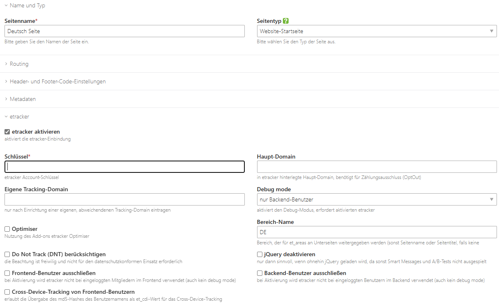
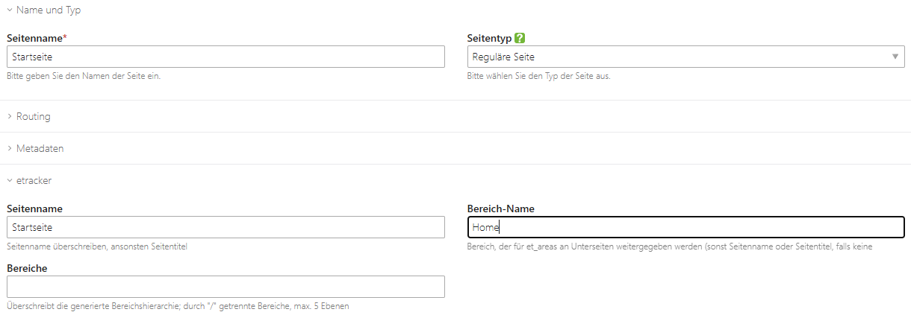
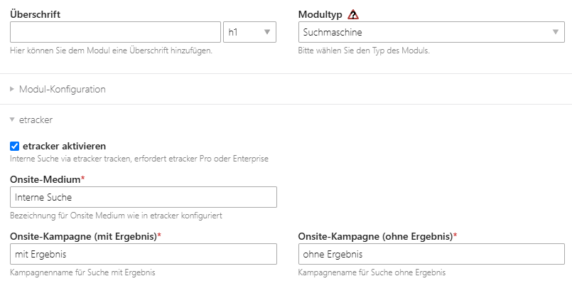

# etracker für Contao CMS (inoffizielles Plugin)

Mit diesem Bundle kann etracker Analytics einfach in Contao eingebunden werden. Kompatibel zu Contao 4.13 und neuer,
einschließlich Contao 5.3.

Es handelt sich noch um eine Vorab-Version in der aktiven Entwicklungs- und Testphase. Jedes Feedback (via Github, im
Contao-Forum oder per E-Mail) ist willkommen.


[](https://www.paypal.com/donate/?hosted_button_id=J425R728CYH9N)

## Features

* etracker-Account je Startpunkt einer Seite
* optionales Deaktivieren des etracker Optimisers
* optionales Deaktivieren des in etracker integriertem jQuery
* optionales Deaktivieren von etracker für eingeloggte Benutzer und/oder Mitglieder
* Setzen der Variable et_pagename je Seite oder automatische Erkennung
* Setzen der Variable et_areas je Seite oder automatische Ermittlung über die Seitenstruktur
* Berücksichtung von Titeln der News, Kalender-Einträge etc.
* Tracking der Formular-Interaktionen (muss in den Formular-Einstellungen konfiguriert werden und erfordert etracker Pro
  oder Enterprise)
* Tracking der Suchergebnisse als Onsite-Kampagne (muss in den Suchmodul-Einstellungen konfiguriert werden und erfordert
  etracker Pro oder Enterprise)
* twig-Templates mit Nutzung von CSP nonce (auch unter Contao 4.13), sodass unsafe-inline nicht mehr erforderlich
  ist ([andere Security Header müssen gesetzt werden](https://www.etracker.com/docs/integration-setup/tracking-code-sdks/tracking-code-integration/funktion-zweck/#integration-security-header))

## Einschränkungen

* nur asynchroner code
* beim Formular-Tracking ist nur ein Fomular pro Seite möglich

## Geplante Funktionen

* deaktivierung Cookie-less tracking
* eigene
  Dimensionen: https://www.etracker.com/docs/integration-setup/tracking-code-sdks/tracking-code-integration/eigene-segmente/
* evtl. Anbindung and Cookiebar

## Voraussetzzungen

* Contao 4.13 oder neuer
* PHP 8.1 oder höher
* [etracker-Konto](https://www.xenbyte.com/go-etracker) (kostenpflichtig)

## Installation

Entweder über den Contao Manager oder mittels composer via `composer require xenbyte/contao-etracker`

## Konfiguration

### Website-Startseite (Root-Ebene)



Die etracker-Integration wird auf den jeweiligen Website-Startseiten aktiviert. Der Account-Schlüssel von etracker ist
das einzige Pflichtfeld. Weitere Felder:

* Haupt-Domain: Die im etracker hinterlegte Haupt-Domain. Diese Angabe wird nur für den Zählungsausschluss benötigt.
  Dieses Konfigurationsfeld wird voraussichtlich noch verschoben.
* Eigene Tracking-Domain: Wenn
  eine [eigene Tracking-Domain](https://www.etracker.com/docs/integration-setup/tracking-code-sdks/eigene-tracking-domain-einrichten/)
  eingerichtet wurde (muss separat bestellt werden), ist die abweichende Tracking-Domain hier anzugeben.
* Debug mode: ermöglicht den etracker-eigenen debug mode, wahlweise komplett oder nur für Backend-Benutzer
* Optimiser: aktiviert den etracker Optimiser für Smart Message oder A/B-Test, welcher jedoch sich im im
  End-of-Life-Status befindet
* Bereich-Name: legt einen Bereichsnamen fest, der für et_area an die Unterseiten weitergegeben wird. Auf
  Website-Startseiten-Ebene wäre bei mehrsprachigen Seiten z. B. die Sprache als Bereich 1 empfehlenswert. Wenn es nur
  eine Website-Startseite (Root-Ebene) gibt, sollte das Feld leergelassen werden.
* Do Not Track (DNT) berücksichtigen: Standardmäßig berücksichtigt etracker die DNT-Angabe des Browsers nicht (
  siehe [etracker-Artikel](https://www.etracker.com/tipp-der-woche-do-not-track/)), die Berücksichtigung kann jedoch mit
  der Einstellung erzwungen werden.
* jQuery deaktivieren: Für den Optimiser lädt etracker JavaScript. Das JavaScript kann mittlerweile bedenkenlos
  deaktiviert werden, wenn der Optimiser nichft für Smart Messages oder A/B-Tests genutzt wird
* Frontend-Benutzer ausschließen: bindet kein Tracking Code für eingeloggte Mitglieder aus, auch nicht bei aktiviertem
  debug mode
* Backend-Bentuzer ausschließen: bindet kein Tracking Code für eingeloggte Benutzer aus, auch nicht bei aktiviertem
  debug mode
* Cross_Devide-Tracking von Frontend-Benutzern: Zum Geräteübergreifenden Tracking kann der Benutzername als md5-Hash
  übermittelt werden

### Reguläre Seite



Sämtliche Angaben für die Unterseiten sind optional.

* Seitenname: Wenn kein Seitenname in den etracker-Einstellungen gesetzt ist, wird der Seitentitel (welcher u. U. aber
  noch den Suffix des Website-Namens enthält) herangezogen.
* Bereich-Name: Standardmäßig identisch zum Seitenname, kann aber überschrieben werden. Dieser Wert wird als Ebenen-Name
  für die Unterseiten weitergegeben.
* Bereiche: Überschreibt die Bereiche für die aktuelle Seite anstatt diese über die Vererbungen zu generieren

### Interne Suche tracken (etracker Pro oder Enterprise)

Als Vorbereitung sind, wie in
der [etracker-Dokumentation](https://www.etracker.com/docs/integration-setup/tracking-code-sdks/tracking-code-integration/onsite-kampagnen/)
beschrieben, "in den Account-Einstellungen unter Einstellungen → Account → Automatische Erfassung → Interne Suche die
Benennung der Suche vorzunehmen". Der Wert für etcc_cmp_onsite ist bei der Contao-Konfiguration zu verwenden.



### Formulare tracken (etracker Pro oder Enterprise)

Um die Formularanalyse zu verwenden, kann bei jedem Formular die entsprechende Option aktiviert werden. Ein abweichender
Formularname, der in etracker verwendet werden soll, kann festgelegtwerden - ansonsten wird die Titel-Angabe verwendet.

Zusätzlich lässt sich bei jedem Formularfeld eine "Sektion" festlegen, ansonsten wird der Wert "Standard" verwendet.
Dies ist beispielsweise bei Formularen mit mehreren Bereichen möglich - eine automatische Erkennung über die Fieldsets
ist (zumindest derzeit) nicht möglich. Für jedes Feld lässt sich auch eine für etracker abweichende Bezeichnung nutzen
bzw. ein kompletter Ausschluss des Feldes festlegen.

### Ereignis-Tracking

Ereignis-Tracking kann entweder über eigenen JavaScript-Code oder im etracker tag manager konfiguriert werden. Für
einige Standardfälle wurden aber zusätzliche Event-Tracking-Vorlagen hinzugefügt:

* Klick auf E-Mail-Adressen (mailto-Links)
* Klick auf Telefonnummern (tel-Links)
* Ausklappen eines Accordion-Elements
* Klick auf Galerie-Bild zur Vergrößerung
* Datei-Download
* Sprachwechsel (bei Standard-Template von contao-changelanguage)

Event-Kategorie, Event-Aktion und Event-Typ sind frei wählbar, für die schnelle Konfiguration sind jedoch Texte als
Vorlage vorausgefühllt. Das Event-Objekt ist abhängig von der gewählten Vorlage hinterlegt. Darüber hinaus sind
benutzerdefinierte Ereignisse (nur click-Trigger) auch über die Contao-Oberfläche
wähbar.

**Hinweis:** Das Anlegen der Ereignisse erfolgt im Menüpunkt `etracker-Events`, die einzelnen Ereignisse müssen jedoch
auf Root-Ebene (Startpunkt einer Website) explizit aktiviert werden.

## CSP-Header für etracker

Ab Contao 5.13 können die CSP-Header direkt im Backend aktiviert werden, für ältere Versionen kann diese Einstellung
auch auf Webserver-Ebene gesetzt werden, allerdings wäre dann mit Einschränkungen von TinyMCE im Backend zu rechnen.

```
Header set Content-Security-Policy "script-src 'self' https://*.etracker.com https://*.etracker.de; connect-src https://*.etracker.de"
```

Bei Verwendung der Scrollmap sollte zudem noch das Einbetten in einen iframe erlaubt werden:

```
Header set Content-Security-Policy "frame-ancestors https://*.etracker.com; script-src 'self' https://*.etracker.com https://*.etracker.de; connect-src https://*.etracker.de"
```
